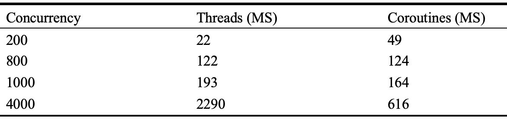
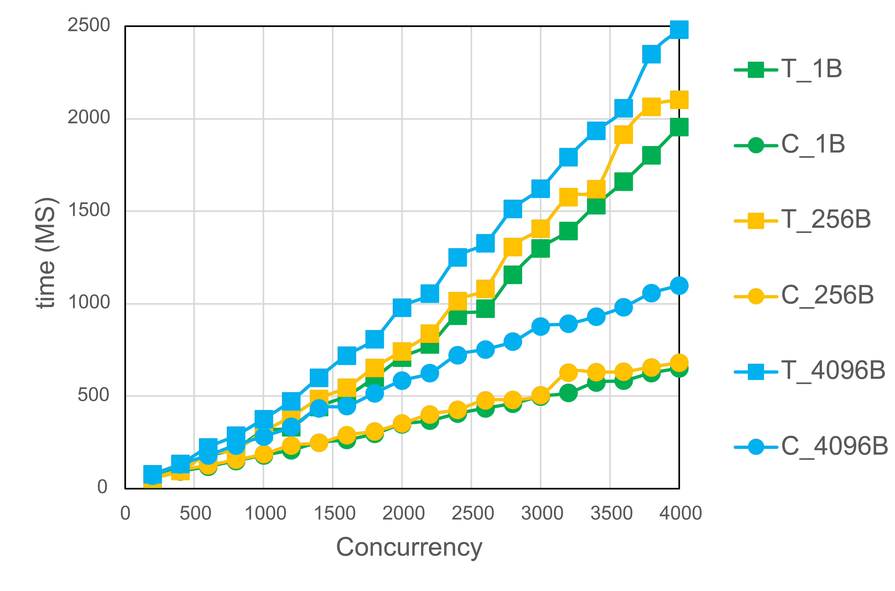

### A Design and Implementation of Rust Coroutine with priority in Operating System


# Abstract 


协程是近年来越来越受欢迎的一个程序设计模型，它的非阻塞式异步和非抢占式调度两大特征在现代编程中的应用非常广泛。低开销的协作式切换是并发编程的有效工具，但对于多个就绪协程来说，如何选择下一个执行，目前缺乏灵活的调度算法。而且，目前针对协程的研究和应用主要集中于用户态的应用程序之内，协程的调度完全是单个进程之内的行为。Rust是一门注重高性能和内存安全的编程语言，非常适合底层系统的开发。本文基于Rust语言的异步机制，提出了一种带优先级的协程模型，可以做到基于优先级的协作式调度。并且通过引入协程优先级位图，使得内核可以通过优先级感知用户态的协程的存在，从而干预整个系统的协程调度。进一步的，本文将此模型实现为一个函数库，它可以应用于一个使用Rust语言编写的OS中，而且可以被内核引入使用，在内核中创建、运行协程。最后，我们通过实验横向对比了引入协程库使用协程的OS，和未引入协程库使用线程的OS之间的性能差异，结果显示，在一定的并发量下，使用协程完成任务的总时间明显小于线程。


## Keywords

Coroutines, Asynchronous Programming, Operating System, Schedule, Rust


# 1. INTRODUCTION


在现代编程中，协程主要是作为non-blocking asynchronous programming的抽象来设计和使用。Asynchronous procedures【**1**】 are procedures whose progression may involve waiting for external events to transpire, but allow for other components of the program to execute while waiting.且由于协程主动让出而引发的切换不会引起页表（进程）的切换，不会引起栈（线程）的切换，不需要内核的参与。多线程技术的栈切换开销会由于并发量的不断增加而成为系统的性能瓶颈，此时，协程就会是一个有效的解决方案。


## 1.1 Coroutine

关于协程的最早的描述由Melvin Conway【**2**】于1958年提出，它是计算机科学领域中一个经过多年发展且备受欢迎的抽象。In the most general sense, coroutines【**1, 3, 4**】 are a generalization of subroutines, equipped with the ability to suspend their own execution, and be resumed by another part of the program later, at which point the coroutine continues execution at the point it previously suspended itself, up until the next suspension or the termination of the coroutine.

线程是对函数（一般称之为线程主函数）的封装，线程的执行就是多个嵌套的函数在栈上进出，并执行相应的指令，所以线程的切换需要保存栈，以及切换时的栈的状态（栈顶指针）。协程是对异步函数的封装，通常它的任务量较小，会以函数调用的方式在线程的栈上运行，而栈必然与一个线程一一对应，所以可以认为一个协程运行在一个线程中。异步函数允许程序在等待外部事件时直接返回，执行程序的其它部分，不会阻塞整个栈的执行流。在同一个线程中运行的多个协程，本质上是在不同时间复用同一个栈执行自己的异步函数。所以，它们之间的切换没有栈的切换开销。当异步函数还未执行到让出点就遭遇中断或抢占时，由于协程以函数调用的方式在线程中执行，所以此时可以使用线程的中断机制，既保存了线程的中断位置和上下文，同时也保存了协程的中断位置和上下文。待线程恢复时协程可以继续执行。

目前有许多函数库和编程语言都提供了协程的使用接口，包括在语言层面直接提供协程支持的Go，kotlin，Lua等，以及Windows Fiber(C++)，libco(C++)，tokio(Rust)等协程库。基于这些语言和函数库提供的协程，编程人员开发出了许多实用的产品，如docker（基于Go语言，可以在一台物理服务器上快速运行多个实例的虚拟化技术），WeChat（基于 libco，A Social software that serves 2 billion people）。


## 1.2 Rust and rCore OS


Rust is a high-level language for developing system software. Its rich type system and ownership model guarantee memory-safety and thread-safety. Moreover, it focuses on performance, so there is no runtime and garbage collector.

Rust虽然没有在语言层面的提供完备的协程机制，但是提供了`async`异步编程模型（async代码的运行依赖于库函数的实现）。Rust编译器会将被`async`修饰的代码块或函数生成为一个状态机，它可以看作是由局部变量，状态指针和多个状态所对应的函数所组成的对象。在每个让出点（等待外部事件的位置）让出时，相当于该状态的函数已经执行完成，栈上已不存在异步函数的内容（我们称之为让出栈）。所以Rust的异步函数因为主动让出引起的切换不需要保存上下文。当它等待的事件到来，被再次唤醒执行时，会从下一个状态所对应的函数开始执行，直到下一个状态。

Rust语言的高性能、内存安全与并发安全等优势，使其非常适合底层软件的开发，在区块链和操作系统领域有很多知名项目，例如Facebook（Meta）开发的加密货币Libra，Google开发的新一代跨平台操作系统Fuchsia，Dropbox 的用于处理数万PB的数据规模的底层存储服务，，以及AWS和Microsoft在其云计算平台中大量使用了Rust重写服务和提供组件。

rCore OS是清华大学开发的一款运行于RISC-V平台之上的类Unix OS，其内核的诸多设计充分利用了Rust的语言特征，便于扩展异步机制。它支持基本的进程调度和线程调度，但不支持协程，本文把实现的协程库应用在了rCore OS之上，并设计了实验对比rCore OS中的线程与协程的性能差异。


## 1.3 Contributions and Paper Organization

本文的主要工作有两点：

1. 提出了一种基于Rust语言特性的协程模型，并用Rust语言将其实现为一个函数库。值得注意的是，本函数库完全基于Rust的核心库实现，所以可以被内核引入使用，使得内核也可以创建、运行协程。而标准库需要有OS的支持，所以不能应用于内核，这是与目前已有的一些只能运行于用户态的协程库（如tokio）的重要区别。
2. 本文为协程引入了优先级，并参考Linux的O(1)调度算法，实现了协程的优先级调度。基于每个进程的优先级位图，进程内的协程按照优先级被调度执行；基于内核的全局优先级位图，每次时钟中断之后，内核会调度拥有最高优先级协程的进程，该进程会在稍后调度运行该进程内，同时也是整个系统内的最高优先级协程。这个机制使得协程调度不再是各个进程内的独立行为，而是所有进程的协程可以通过优先级被内核统一控制。

本文在接下来的第二章中会介绍（present）协程模型的设计与实现细节，第三章中给出性能对比实验并在第四章做出总结。


# 2.  COROUTINE MODEL DESIGN


这一章会描述此协程模型的整体框架与设计细节。我们先介绍模型及其基本的运行机制，然后介绍此模型提供的接口的使用方法和功能，之后我们再介绍协程的优先级调度的设计与实现，最后我们会介绍协程的唤醒的机制。

## 2.1 Overview


【Figure 1】

Figure 1是此协程模型的架构图。Rust语言提供异步函数，协程库提供优先级和协程ID字段，并将它们封装为一个数据结构，称之为协程控制块。每个协程控制块都代表一个协程。我们使用协程ID作为索引，把所有的协程保存在进程的堆内存上的一个哈希表中。通过遍历此表即可得到所有协程，也可以通过协程ID得到指定协程，或将其删除。此时，协程可以看作是与全局的异步函数一一对应的调度对象。协程调度器提供插入和删除协程的两个必要接口，并实现协程的调度算法。对于优先级调度，我们会设置多个优先级队列，每个队列拥有不同的优先级，在其中保存协程ID。按照优先级从高到低查询队列，即可完成优先级调度。当需要协程的完整信息时，通过协程ID索引得到。考虑到协程在其生命周期内会由于等待外部事件而多次进出调度器，对比于调度器直接管理协程，这样做可以减少调度器工作时的内存移动开销。我们通过优先级位图使得内核可以控制整个系统的协程优先级调度，它的设计与实现会在2.3中介绍。以上是进程之内的协程布局。

函数的执行必然要依赖于栈，异步函数也是如此。对此我们有如下设计：当一个协程需要执行时，我们启动协程执行器，它本质上是一个函数。协程执行器会在一个loop循环中依次取出所有处于就绪状态的协程并执行，此线程的栈会被即将执行的协程用来执行自己的异步函数。当协程执行完毕或主动让出，会退出所占据的线程栈，此时“协程执行器”线程空闲，它的栈将被下一个协程使用。如果不存在就绪协程，那么协程执行器线程跳出循环并结束。

我们在此引入“动态绑定”的概念，即：协程（异步函数）的执行需要栈，但是协程在多次主动让出与重新执行的过程中，有可能在多个不同的栈上执行；而同一个栈也总是会执行不同的协程。此模型的协程拥有动态绑定能力。

协程因为等待外部事件而让出之后还需要被唤醒，唤醒是协程的关键机制，这部分内容在2.4中做详细介绍。

## 2.2 Interface

此模型向外提供两个接口，创建协程和启动协程执行器，我们将这个模型实现为一个函数库，用户态与内核态都可以以调用库函数的方式使用这两个接口。

```rust
Interface1:
fn coroutine_create(async_func, priority = DEFAULT);
```

创建协程的接口`coroutine_create`要求传入一个异步函数，其中封装了这个协程需要执行的指令语句。Rust语言中，只需要在普通函数声明前添加async关键字，即可将函数声明为异步函数。此外还可以在在参数中指定协程的优先级，如果没有指定，则协程优先级会被设置为默认值。协程创建接口会把传入的异步函数封装为协程，并插入协程队列，等待被调度执行。

```rust
Interface2:
fn coroutine_run(wait);
```

启动协程执行器接口`coroutine_run`可以跳转到负责调度并执行协程的函数，调用此接口的线程称之为协程执行器。当进程中不存在协程（没有创建协程或全部执行完成）时，此接口会立即退出；当进程中不存在就绪协程，但存在等待协程时，可以通过接口传入的参数选择退出接口，或等待就绪协程的出现。


## 2.3 Priority and Schedule

我们根据优先级处理协程的调度顺序。在进程之内，协程根据优先级从高到低依次执行；在进程之间，拥有最高优先级协程的进程会被优先调度。调度器只针对协程ID进行操作，以简化内存操作，当需要协程的完整信息时，可以通过协程ID映射得到。

### 2.3.1 Coroutine scheduling within a process

协程具有优先级属性，处于相同优先级的协程的ID被同一个队列管理，多个不同的优先级会对应多个不同的队列，它们组成一个队列组，每个进程有且仅有一组优先级队列，存放在进程的堆内存中，优先级队列中的协程都处于就绪态，也就是都可以立即被调度执行，只是用优先级区分了执行的先后顺序。显然，刚创建的协程会被立即插入队列。对于非就绪状态的协程，在被唤醒之后会重新插入到优先级队列中，具体过程会在【2.4】中介绍。

```python
# Algorithm 1
def excute(bool wait):

```

在任意线程的任意位置，我们可以调用【2.2】中的`coroutine_run`接口执行协程。该接口会最终跳转至`excute`函数，它如【Algorithm 1】所示，会在一个loop循环中，从调度器获取一个协程ID，此时调度器会根据优先级从高到低访问队列，当出现第一个非空队列时，从队列中弹出一个协程ID，此时这个协程就是该进程内可以立即执行的优先级最高的协程之一。

如果所有队列为空，则进程内没有可以执行的协程，调度器会返回一个空值。此时会进一步判断协程数量为否为0，即，是否存在处于等待状态的协程。如果不存在，则说明所有协程执行完成，可以退出协程执行器，如果存在，则根据传入的参数，选择退出`excute`函数，或是调用系统调用执行线程的主动让出。


### 2.3.2 Coroutine Scheduling of the Whole System

基于前文的设计，可以在进程之内实现协程的优先级调度，现在我们把它推广到整个系统中，对所有进程的协程进行优先级调度。这需要在内核中获取到所有进程的协程的优先级信息，并记录拥有最高优先级的协程的进程，随后从内核切换到用户态时，调度该进程，就可以在该进程内调度运行最高优先级协程。

#### 2.3.2.1 Priority Bitmap

我们使用位图处理协程的优先级信息。

每个进程会维护一个位图，它的长度，即比特位个数，为协程的优先级数，每一位的取值为0或1，代表进程中是否存在该优先级的协程。当访问调度器插入协程或获取协程时，如果某个优先级的队列从空变为非空，或是从非空变为空，都会修改进程位图中的对应位为1或0。

内核也有属于自己的地址空间和页表，可以创建、运行协程。所以内核也拥有一个优先级位图表征其所管理的协程的优先级信息，称之为内核位图。

此外，我们在内核中设置一个额外的位图，表征整个系统的协程的优先级信息，称之为系统位图。此位图的长度为协程的优先级数，但每一位的0或1代表的是整个系统的所有进程中，是否存在该优先级的协程。要计算这个位图需要使内核可以访问到所有进程的位图，我们的做法是，指定一个虚拟地址作为进程在用户态访问位图的地址，在进程初始化时，向内核申请一个空闲的物理页面，将指定的位图虚拟地址，与此物理页的起始地址建立映射，并赋予进程读写的权限，就可以使进程在用户态对位图进行读写，内核也可以直接访问到进程的位图。

我们将进程ID与进程位图的物理地址建立映射，就可以在内核中通过枚举进程ID，获取到所有的进程位图。


【Figure 2】

系统位图的取值基于所有的进程位图，在每个时钟中断到来时，遍历所有进程的位图，更新系统位图。这里只需要对所有进程位图进行或运算：只要其中有一个进程的一个协程属于该优先级，系统位图中的对应位就是1；只有当所有进程都不存在该优先级的协程，系统位图的对应位才会是0。把所有进程位图的或运算结果赋值给系统位图，即完成了更新。


#### 2.3.2.2 Global Scheduling Based on Priority Bitmap

目前的系统具备了进程位图和系统位图，可以实现在每次时钟中断之后总是调度拥有最高优先级协程的进程。在一个时钟中断之内，进程的位图会随着协程的创建与回收而发生变化，但各个进程的位图变化在下一次时钟中断之前，不会同步到系统位图。也就是说，当最高优先级协程退出执行（完成或主动让出），下一次时钟中断到来之前的这段时间之内，对于整个系统来说，目前还不遵循优先级调度。如果希望整个系统的所有协程在运行期间严格遵守优先级调度，我们提供如下设计：

​		协程会因为执行完成或主动让出从而退出执行，让出线程栈。无论是哪种情况，都会在之后进入下一轮循环，再次访问调度器获取协程并执行。在进入下一个循环之前，我们读取进程位图与系统位图，比较二者记录的最高优先级，相当于是在查询本进程内是否还有未执行的最高优先级协程。如果进程中的协程最高优先级小于系统位图中记录的所有进程中的协程最高优先级，就说明本进程内的最高优先级协程已经全部执行完成，此时调用`yield`系统调用让出当前处理器，进入内核更新系统位图并根据结果进行调度；否则，继续执行。

显然，如果要追求严格的优先级调度，会多次更新系统位图而引入大量开销，所以这个机制应该作为一个选项来提供。由于这是协程执行器的行为（由它决定是否判断系统位图），所以我们可以通过一个参数去控制它，默认情况下执行宽松的优先级调度，也就是只在每次时钟中断之后进入调度拥有最高优先级协程的进程，在一个时钟中断之内不更新系统位图。

## 2.4 Excutor and Asynchronization 

 Excutor是模型中的协程管理机构，负责管理上文提到的协程数据机构，优先级队列，以及本节要介绍的协程的唤醒机制。


【Figure 3】

当一个协程执行退出执行，让出所占据的线程栈时，有两种情况：

1. 协程执行完毕，协程主函数执行完成并返回，此时会根据协程ID查找到协程的数据结构并释放其所占据的堆内存；
2. 协程未执行完毕，由于等待某个事件到来而不能继续执行，选择主动让出，此时的做法是，不把协程ID插入回调度队列，而直接进入下一轮循环，访问调度器取出下一个协程执行。当主动让出的协程等待的事件到来时，进行唤醒操作，也就是把被唤醒的协程ID插回调度队列。这就是本模型中的协程的异步机制。这样的设计保证了调度器的工作效率，调度队列里的每一个协程都处于可以立即执行的就绪状态，访问调度队列时不用判断协程的状态，也不会访问到等待状态的协程。

现在我们知道，完成唤醒一个协程的操作就是把该协程的ID插入对应的优先级队列，这需要协程ID，协程优先级，优先级队列的地址。我们可以将这三个变量封装为一个数据结构称之为TaskWaker，并在协程ID和对应的TaskWaker之间建立起映射，当需要唤醒一个协程时，仅需要给出其协程ID。在协程执行之前必须检查是否创建了TaskWaker，没有则创建，并交由Excutor管理。

所以现在的关键问题是，执行等待事件与唤醒操作的协程，怎样拿到等待被唤醒的协程ID。我们在此引入一个基于HashMap实现的数据结构称之为WakerMap，维护整数key值到协程ID的映射。对于等待的协程与执行唤醒操作的协程，它们需要在创建时传入相同的key值（这需要在进程内使用一个互斥访问的全局计数器），建立起联系，当需要等待的协程执行到等待操作时，把key值与协程ID的键值对插入到WakerMap，之后执行唤醒操作的协程进行唤醒时，就可以根据key值直接查找到需要被唤醒的协程ID，再根据TaskWaker就可以将处于等待状态的协程的协程ID插入回调度队列，完成唤醒操作；如果是执行唤醒操作的协程优先被调度执行，在查询WakerMap时就会查找到空项而直接跳过，当执行等待操作的协程执行时 ，会发现等待的事件早已到来（比如说缓冲区中的数据已经写入完成），便不会主动让出。

基于上述的设计与实现，我们可以将本模型的协程调度概括为：考虑到整个系统（包括用户态和内核）内的处于就绪状态的协程，在每次时钟中断之后，会进入拥有最高优先级协程的地址空间，然后由该进程调度执行最高优先级协程。也就是说，如果用户态存在相比于内核态优先级更高的协程，那么会先调度执行用户态程序。


# 3. PERFORMANCE COMPARISON 

> 8月25日完成
>
> 对rcore的改造；
>
> 实验一：不涉及内核态，完全在用户态的测试；
>
> 实验二：管道读写，有内核态的参与；


我们在rCore OS上引入了这个协程库，使得rCore可以创建和执行协程，并且设计并进行了实验，对比了引用此协程库的rCore与未经修改的rCore，分别使用协程和线程执行相同任务的性能差异。


## 3.1 Experiment A: Test in user mode without syscall

此实验在用户态使用协程或线程进行普通的函数调用，不使用系统调用，没有内核参与。


【Figure 4】

我们设计了如图【figiure 】所示的实验。实验步骤如下：

1. 实验被创建为进程执行，每个进程内创建N个协程或线程执行任务，这N个协程或线程编号从1到N，编号的值通过参数传入。在进程开始时获取一个起始时间，在进程退出前获取一个结束时间，以二者时间差作为任务的总执行时间；
2. 每个协程或线程都会互斥读写一个全局变量，先执行读，读成功后执行写。全局变量初始值设置为0，当协程或线程读到的全局变量的值等于自己的编号时，认为读取成功，然后执行写操作，即把全局变量的值加1。当所有协程或线程创建完成之后，主线程把全局变量值加1，使得编号为1的协程或线程可以开始读写。
3. 当读取不成功时，协程使用异步机制主动让出，等待被唤醒；线程则调用系统调用进行线程切换。
4. 实验中协程和线程的并发量从200递增到4000，步长为200；


【Figure 5】




【Teble 1】


从【Figure 】中可以看出，当并发量较小时，协程的总执行时间大于线程。随着并发量的增加，协程的执行总时间稳定增加，而线程的执行总时间快速增加并超过协程。从【Table 】中可以看到，在本实验中，当并发量为200时，协程的性能弱于线程；当并发量大于等于800时，协程的性能开始超过线程；当达到测试的最大并发量4000时，协程的总执行时间约为线程的`26%`。


## 3.2 Experiment B: Test in user mode with syscall

此实验在用户态进行，每个协程和线程都会使用读写系统调用，有内核参与。


【Figure 6】

我们设计了如图【figiure 】所示的实验。实验步骤如下：

1. 实验被创建为进程执行，每个进程内创建N个协程或线程执行任务，这N个协程或线程编号从1到N。编号的值通过参数传入。在进程开始时获取一个起始时间，在进程退出前获取一个结束时间，以二者时间差作为任务的总执行时间；
1. 我们创建N + 1个管道，编号从1到N + 1，管道可以被读写。所使用的管道的工作方式为：只有当写端关闭时，对此管道的读操作才可以读取到数据然后完成读操作；当写端未关闭时，读操作会在内核引发线程切换；
1. 每个协程或线程执行管道的读写操作，具体来说，编号为i（1<= i <= N）的协程或线程会从编号为i的管道读取数据，待写入端关闭，读取成功后，向编号为i + 1的管道中写入数据，然后关闭编号为i的管道的写端，使得编号为i +1的协程或线程可以完成读操作。相当于使用管道把所有协程或线程串联起来，对同一个管道的读写操作分别位于编号相邻的两个协程或线程中。
1. 所有的协程或线程创建完成之后，测试进程的主线程会直接向管道1写入数据然后关闭它的写端，此后随着task的调度和执行，数据就会被编号为1的task从编号为1的管道中读出，然后写入管道2，编号为2的task再从管道2读取数据，然后写入管道3，以此类推；
1. 每次实验读取与写入的数据量相同。我们测试了1B，256B，4096B这三个数据量。
1. 实验中协程和线程的并发量从200递增到4000，步长为200；


【Figure 7】


 【Figure 8】


  【Figure 9】



 【Figure 10】


【Teble 2】


【Teble 3】


【Teble 4】


从【Figure 】中可以看出，当并发量较小时，协程与线程的总执行时间的差距较小。随着并发量的增加，线程的执行总时间快速增加并超过协程。从【Table 】中可以看到，在本实验中，当并发量为200时，协程的性能弱于线程；当并发量大于等于400时，协程的性能开始超过线程；当达到测试的最大并发量4000时，协程的总执行时间约为线程的`32% - 44%`。

通过实验我们可以看出，并非在所有情况下协程都能表现出比线程更好的性能。当并发量较小时，包括协程调度器与唤醒机制在内的维护协程运行的基本开销影响较大，导致此时的协程性能接近线程。但协程的使用开销随着并发量的增大呈线性增长的趋势，也就是说，并发量的增加并不会对协程的平均执行时间和平均切换时间造成明显影响。而线程的上下文切花开销随着并发量的增加而增大，这导致当并发量增加时，协程的性能逐渐超过线程，且二者差距越来越大。

# 4. CONCLUSION

本文提出并实现了一个基于Rust语言特性的协程模型，一个Rust操作系统可以利用此协程库在用户态和内核态创建并运行协程。协程具备优先级属性，支持优先级调度。我们基于Linux的O(1)调度算法，设计了进程的协程优先级位图和内核的协程优先级位图，使得协程的调度不再是各个进程之内的独立行为，而是可以被内核统一控制，使得整个系统内，某些对于执行时间敏感的协程可以被优先调度，而一些对于执行时间不敏感的协程则可以设置较低优先级，减少与高优先级任务的争抢，使处理器可以更灵活、更科学地被分配。

我们在rCore OS上引入了此协程库并进行了性能对比实验，实验结果显示，并不是在所有情况下协程的性能都优于线程。当并发量较小时，协程的执行时间会大于线程，这是由于运行协程所需要的基本开销，如调度、切换和唤醒，对于并发数较小时的任务量来说，影响较大，但随着并发量的增加，协程的运行开销增长缓慢，而线程的运行开销增长迅速，且此劣势带来的影响越来越大。当并发量大于`200 - 800`时，线程的执行时间超过协程，且二者差距越来越大，当并发量达到4000时，协程的总执行时间约为线程的`26% - 44%`。


# REFERENCES

1. 

2. Melvin E Conway. 1963. Design of a Separable Transition-Diagram Compiler. Commun. ACM 6, 7 (1963), 396–408.
3. 
4. Ana Lúcia De Moura and Roberto Ierusalimschy. “Revisiting corou- tines”. In: *ACM Transactions on Programming Languages and Systems* *(TOPLAS)* 31.2 (2009), pp. 1–31.


