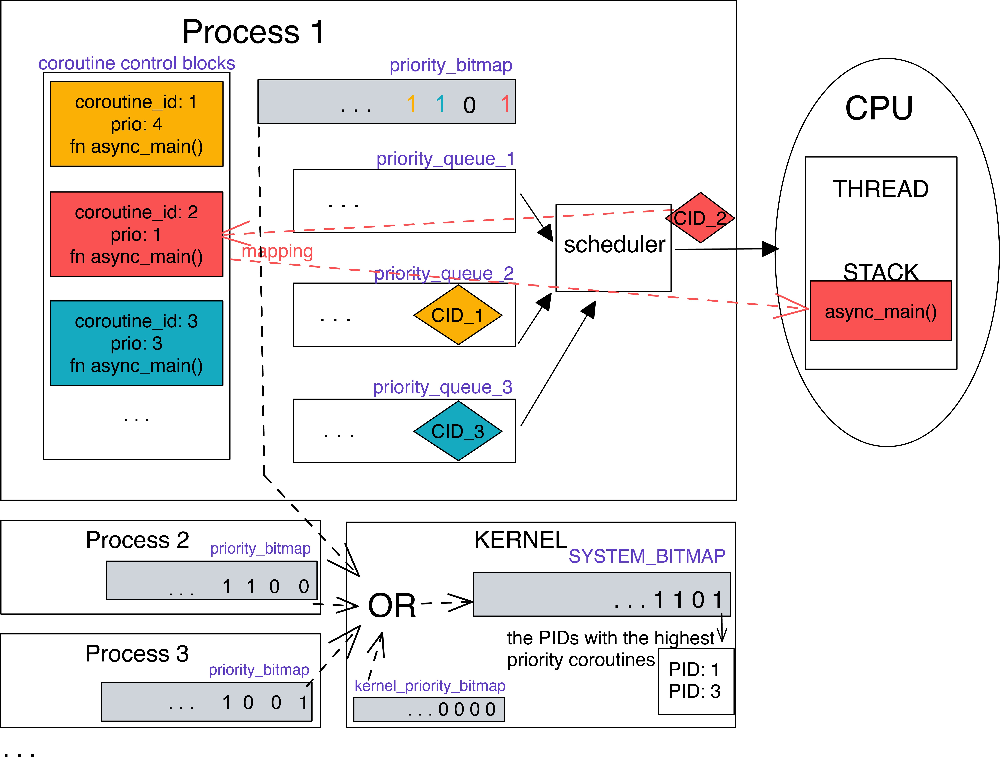
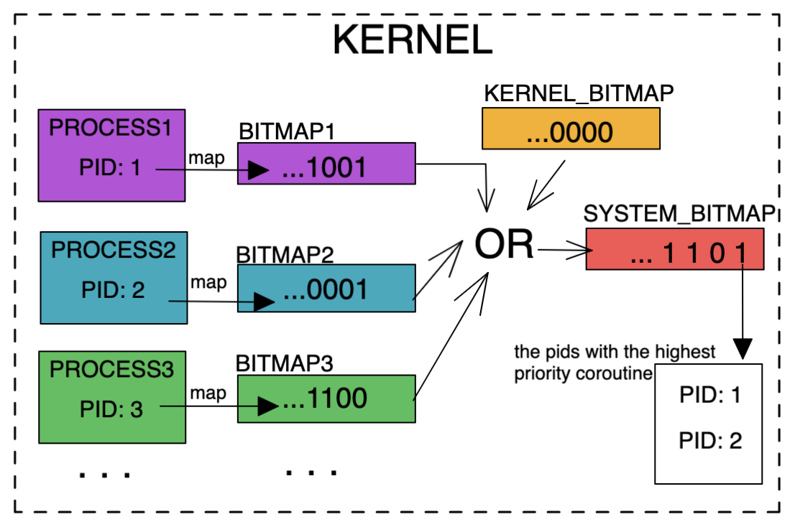
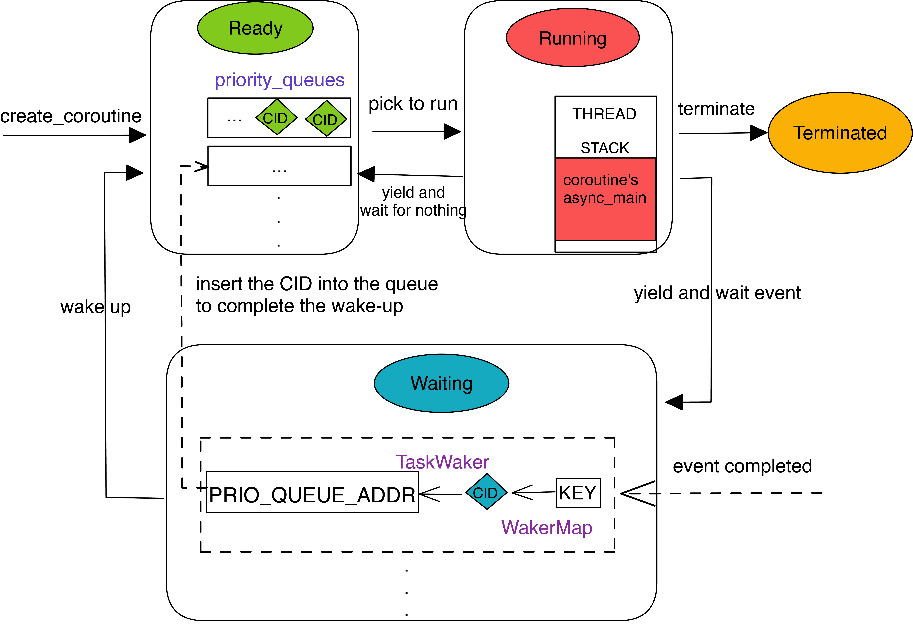
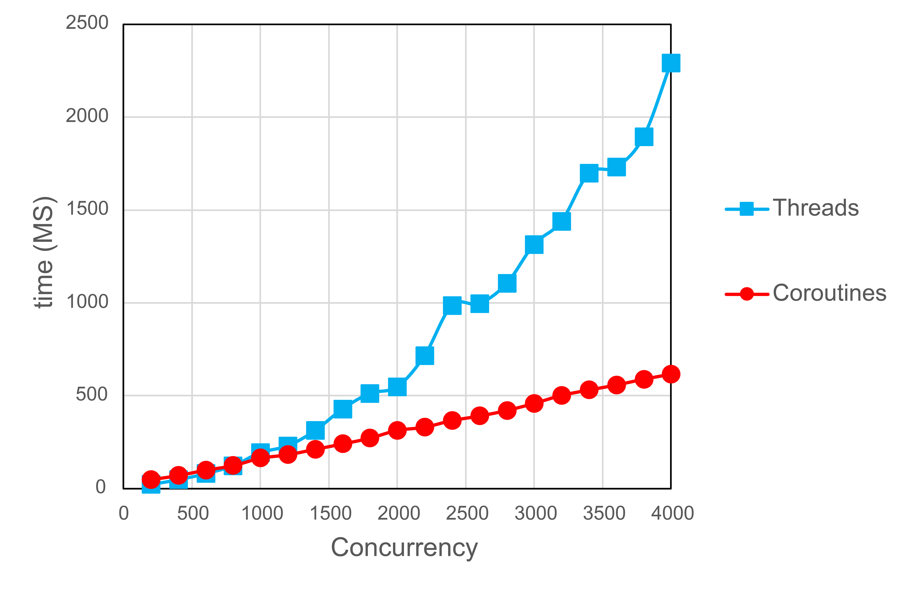

### A Design and Implementation of Rust Coroutine with priority in Operating System


# Abstract 


摘要

图片说明、引用

贡献


Non-preemptive cooperative scheduling of the coroutine is an effective tool for concurrent programming due to its low cost. Still, there is currently a lack of flexible algorithms for scheduling, and the current research and application of the coroutine are mainly concentrated in user mode, and the scheduling of coroutines is ultimately a behavior within a single process. 

This paper proposes a coroutine model with priority and implements it as a library based on the rust language, and it can be used in both user-mode programs and the kernel. In addition, by introducing the priority bitmap into the kernel, it can perceive the existence of user-mode coroutines through priority, and thus intervene in the coroutine scheduling of the entire system.

Further, we compared the performance difference between the threads and the coroutines implemented in this paper through experiments. The results show that with sufficient concurrency, the performance of the coroutine is significantly better than the thread.


## Keywords

Coroutines, Asynchronous Programming, Operating System, Schedule, Rust


# 1. INTRODUCTION


After a thread enters the kernel through a system call, it needs to wait for the service to complete before returning to the user mod to continue execution, otherwise the entire thread will be blocked. When coroutines are introduced into both user mode and kernel mode, the kernel can encapsulate the service requested by the thread into a coroutine. Therefore, when a thread enters the kernel, it only needs to submit a request to return to the user mode immediately, and continue to execute other coroutines, further improving the concurrency. In addition，the cooperative switching between coroutines will not cause the switching of the page table (process) nor the stack (thread) and does not require the participation of the kernel. The stack-switching overhead of multi-threading technology will become the system's performance bottleneck due to the continuous increase of concurrency. At this time, coroutines will be an effective solution.


## 1.1 Coroutine

The earliest description of coroutines was proposed by Melvin Conway【**2**】 in 1958, and it is a popular abstraction in computer science that has developed over the years. In the most general sense, coroutines【**1, 3, 4**】 are a generalization of subroutines, equipped with the ability to suspend their own execution, and be resumed by another part of the program later, at which point the coroutine continues execution at the point it previously suspended itself, up until the next suspension or the termination of the coroutine.

The **stacked coroutine** [] is similar to the thread which holds the call information on the stack. As a coroutine is created, stack memory is allocated to hold the context of the coroutine, and if a child coroutine is created, it continues to be pushed to the stack. The feature of the stacked coroutine is that users do not need to worry about the scheduling. The dis- advantage is that it is difficult to allocate a reasonable stack size. The state-of-art languages that use stacked coroutines are Lua [11] and Golang [19].

**Stackless coroutines** are used like functions. which store coroutine local variable in heap memory. Since there is no stack, subroutines can be woken up anywhere in the program. The stackless coroutine is characterized by the low overhead of coroutine switching. The disadvantage is that coroutine scheduling is unbalanced and users need to intervene in the scheduling. Popular languages such as C++ [2], Rust [18], Kolint [13] and Python [34] use stackless coroutines. The coroutine model in this paper is also stackless.

There are currently many function libraries and programming languages that provide interfaces for coroutines, including Go, kotlin, Lua, etc. that directly support coroutines at the language level, as well as Windows Fiber (C++), libco (C++), tokio (Rust) and other coroutine libraries. Based on the coroutines Such as docker (based on Golang, a virtualization technology that can quickly run multiple instances on a physical server), and WeChat (based on libco, A Social software that serves 2 billion people).


## 1.2 Rust and rCore OS


For the above programming languages, we need to choose one to implement the coroutine model. For performance reasons, we first exclude golang and kotlin due to their garbage collectors, and python. We choose the latter between C++ and Rust due to memory safety concerns, as its ownership model largely eliminates the need for manual reference counting. Based on the above advantages, Rust is very suitable for the development of low-level software, such as the cryptocurrency Libra developed by Facebook (Meta), and the new generation of cross-platform operating system Fuchsia developed by Google.

In addition, the `async/await` programming model provided by Rust language has strong support for asynchrony, and this feature can be used to create asynchronous functions easily. During its execution, it will exit many times in the form of function return, and then continue to execute after being woken up. We can simply process the asynchronous function to obtain the data structure used to describe the coroutine, that is, the coroutine control block.

rCore OS is a Unix-like operating system developed by Tsinghua University and runs on the RISC-V platform. Many designs of its kernel make full use of the features of the Rust language to facilitate the extension of asynchronous mechanisms. It supports processes and threads but does not support coroutines. This article applies the implemented coroutine library to rCore OS and designs some experiments to compare the performance differences between threads and coroutines in rCore OS.


## 1.3 Contributions and Paper Organization

The main work of this paper has two points:

1. This paper proposes a coroutine model with priority, which does not depend on the support of the operating system, so it can be used in both user-mode programs and the kernel. In addition, by introducing priority bitmaps, we unify the coroutine scheduling of user mode and kernel mode, which means that all coroutines in the system will be in the same scheduling framework.
2. We present a reference implementation of a library based on the Rust language, and verify through experiments that coroutines are significantly better than threads under high load conditions.

This paper will present the design and implementation details of the coroutine model in the next second section, give a performance comparison experiment in the third section and make a conclusion in the fourth section.


# 2.  COROUTINE MODEL DESIGN


This section describes the overall framework and design details of this coroutine model. We first introduce the model and its fundamental operating mechanism, then introduce the usage and functions of the interface provided by this model, then we will introduce the design and implementation of the priority scheduling of the coroutine, and finally, we will introduce the design of the wake up mechanism of the coroutine.

## 2.1 Overview



【Figure 1】

As shown in \textit{Figure 1}, the Rust language provides asynchronous functions, and the coroutine library provides priority and coroutine ID fields and encapsulates them into a data structure called a coroutine control block. Each coroutine control block represents a coroutine. And a coroutine can be regarded as a scheduling object corresponding to a global asynchronous function one-to-one. We use the coroutine ID as an index to store all the coroutines in a hash table on the process's heap memory. We can get or delete its corresponding coroutine control block through the coroutine ID.Considering that the coroutine will enter and exit the scheduler many times during its life cycle due to waiting for external events, compared to the scheduler directly managing the coroutine control block, it can reduce the memory overhead when the scheduler works. 

The coroutine scheduler provides two necessary operations: push and pop, which are used to insert and delete coroutines, and implement the coroutine scheduling algorithm. For priority scheduling, we will set up multiple queues, each with a different priority, and store the coroutine ID of the coroutine at the corresponding priority in it. Query these queues from high to low priority to complete priority scheduling. 

We use the priority bitmap to describe the priority layout of the coroutines within each process. We also use a bitmap in the kernel to describe the priority layout of the coroutines of all processes. The kernel can perceive the existence of coroutines and their priority through these bitmaps, and formulate the scheduling strategy of the process, thereby indirectly intervening in the coroutine scheduling in the user mode. This makes coroutine scheduling no longer an independent behavior within each process but allows them to be considered uniformly from a global perspective. Its design and implementation will be introduced in Section 2.3. The above is the coroutine structure within the process.

The execution of functions must depend on the stack, the same is valid for asynchronous functions. For this, we have the following design: When a coroutine needs to be executed, we start the coroutine executor, which is essentially a function. The coroutine executor will take out all the coroutines in the ready state and run them in a loop. The coroutine will use this thread's stack to execute its asynchronous function. When the coroutine is completed or suspended due to waiting for external events, it will exit the occupied thread stack by returning the function. At this time, the thread running the coroutine scheduler can take out the next coroutine from the scheduler to run

The coroutine needs to be woken up after it yields because it waits for external events. Wake-up is a key mechanism of the coroutine. This part is described in detail in Section 2.4.

## 2.2 Interface

The coroutine model will be presented as a function library, which only provides an interface-coroutine_run, it will be used to create coroutines and start the coroutine executor.

```rust
Interface1:
fn coroutine_run(async_func, prio = DEFAULT) {
    create_corotine(async_func, prio);
  	if get_coroutine_size() <= 1:
        run();
}
```

We use the `async` keyword provided by the Rust language to create an asynchronous function, where the asynchronous code statement needs to be decorated with the `await` keyword, and this asynchronous function will run as the main function of the coroutine. When no coroutine priority is specified it will be given the default value. If we need to execute a batch of coroutines, this interface should be nested in an asynchronous function to create coroutines in batches. When the first coroutine is created, the interface needs to call the run function to start the coroutine executor; when the number of coroutines is greater than 1, it means that the executor has been started, and this interface only needs to complete the creation of the coroutine.


## 2.3 Priority and Schedule

We handle the scheduling order of coroutines based on priority. Within a process, coroutines are executed from high to low priority; between processes, the process with the highest priority coroutine will be scheduled first. 


### 2.3.1 Coroutine scheduling within a process

Each coroutine has a priority. After the coroutine is created, it will be inserted into the corresponding priority queue and wait to be scheduled for execution. The scheduler scans the queues according to the priority from high to low, and searches for the first non-empty queue to complete the priority scheduling. Only the coroutines in the ready state are saved in the queues, and the coroutines in the waiting state will be reinserted into the queue after being awakened, which ensures the query efficiency of the scheduler.

### 2.3.2 Coroutine Scheduling of the Whole System

Based on the previous design, the priority scheduling of coroutines can be implemented within the process. Now, we extend it to the entire system to perform priority scheduling on the coroutines of all processes. 

#### 2.3.2.1 Priority Bitmap

We use bitmaps to describe the priority layout of coroutines.

Each process will maintain a bitmap whose length is the number of priorities of the coroutines, and the value of each bit is 0 or 1, indicating whether there is a coroutine in the ready state  of that priority. 

The kernel of a modern operating system basically has an independent address space and page table, so the kernel also has a priority bitmap to represent the priority information of the coroutines it manages, called the kernel bitmap.

In addition, we set an extra bitmap in the kernel to represent the priority information of the coroutines of the whole system, which is called the system bitmap. But the 0 or 1 of each bit represents whether there are coroutines of this priority in all processes and the kernel of the entire system.

According to the definition of the system bitmap, we can know that its value is the result of the OR operations of all processes and kernel bitmaps-as long as at least one coroutine of at least one process belongs to this priority, the corresponding bit in the system bitmap is 1; and only when all processes do not have coroutines of this priority, the corresponding bit in the system bitmap will be 0. As shown in Figure, it will be calculated when the clock interrupt arrives.

Now we explain how the kernel gets all the bitmaps.

Our approach is to specify a virtual address as the address of the process accessing the bitmap in user mode. Then, when the process is initialized, apply to the kernel for a free physical page, map the specified virtual address to the starting address of the physical page, and grant the process permission to read and write this address. In this way, the process can read and write the bitmap in user mode, and the kernel can also directly access the bitmap of the process. We map each process ID with the physical address of its process bitmap, and we can get all process bitmaps in the kernel by enumerating the IDs of the processes.



【Figure 2】


#### 2.3.2.2 Global Scheduling Based on Priority Bitmap

Based on the above bitmaps, we can guarantee the global priority scheduling when the clock interrupt arrives: the system bitmap will be updated when the clock interrupt arrives, and then the process or kernel with the highest priority coroutine can be scheduled to run according to the result, and the highest priority coroutine will be scheduled to run in this address space, We call this relaxed global priority scheduling.

Within one clock cycle, the changes in the priority layout of coroutines caused by the creation, wake-up and deletion of coroutines are synchronized to the system bitmap in time, so that the process with the highest priority coroutine is always prioritized scheduling, we call this strict global priority scheduling.  Our specific measures are: the bitmap of the process can always be updated in real time by the execution of the coroutines, so before each execution of the coroutine, compare the highest priority recorded in the process bitmap and the system bitmap, If and only if there is a coroutine with a higher priority recorded in the system bitmap, it will enter the kernel through a system call to update the system bitmap, and then reschedule according to the result.

Obviously, adopting strict global priority scheduling will ensure that the highest priority coroutine in the system is always executed first, but it will also introduce a lot of overhead by frequently entering the kernel within a clock cycle, and relaxed scheduling is the opposite. Fortunately, which scheduling strategy to adopt is the behavior of the coroutine executor itself, and we can control which strategy it chooses through a parameter according to needs.


## 2.4 Coroutine Manager and Asynchronization 

The Coroutine Manager is responsible for managing the coroutine control blocks, the scheduler, and the coroutine wakeup mechanism introduced in this section.



【Figure 3】

Only the IDs of the coroutines in the ready state are saved in the priority queue of the scheduler, so the wake-up operation can be completed by inserting the IDs of the coroutines awakened from the waiting state into the queue, and it only needs the ID and priority of the coroutine, and the address of the queue. We can encapsulate these three variables into a data structure called TaskWaker, and establish a mapping between the coroutine ID and the corresponding TaskWaker. So when a coroutine needs to be woken up, only its coroutine ID is needed. We will check whether its TaskWaker is created before each coroutine is executed, and delete it when the coroutine is deleted. Obviously, TaskWaker should be managed by the coroutine manager.

Now the coroutine executing the external event can use TaskWaker to wake up the suspended coroutine. But the key question is how it gets the ID of the coroutine it is going to wake up. We introduce a data structure called WakerMap here, which maintains the mapping of integer key values to coroutine IDs. For the waiting coroutine and the coroutine that performs the wake-up operation, they need to pass in the same key value when they are created (this requires the use of a global counter with mutually exclusive access within the process) to establish a connection. The waiting coroutine will insert the key and ID into WakerMap, and the wake-up coroutine can access TaskWaker and WakerMap through the same key to wake it up. If the wake-up coroutine is executed first, a null value will be read when accessing the WakerMap and the wake-up operation will be omitted, and then the waiting coroutine will not be suspended because the waiting event has already arrived (for example, the buffer has written enough data).

# 3. PERFORMANCE COMPARISON 

We introduce this coroutine library on rCore OS to compare the performance between coroutines and threads. Each experiment creates multiple processes to run, and each process runs coroutines or threads, which will perform some of the same work. Two times are collected at the beginning and end of the process, and the difference between them is used as the running time of each test. We will compare multiple runtimes under multiple concurrency levels, and summarize the performance characteristics of coroutines and threads from them.


## 3.1 Experiment A: Test in user mode without the syscall

In this experiment, we test the performance of coroutines and threads in user mode, and will not actively call system calls to enter the kernel. In order to reflect the asynchronous characteristics of coroutines and the context switching of threads, coroutines or threads will mutually exclusive read and write a global variable. Specifically, multiple coroutines or threads will be created in the process, and they will be numbered sequentially starting from 1, and the value of the global variable will be initialized to 0. When all coroutines or threads are created, the main thread of the process will modify the value of the global variable to 1. Each coroutine or thread will read the global variable, and if the value is equal to their own number, they will add 1 to the value of the global variable. Otherwise, the coroutine will be suspended through the asynchronous mechanism, and the thread will be switched through the yield system call.




【Figure 5】


【Table 1】


We tested the execution time under each concurrency from 200 to 4000 with an interval of 200, and the test results are shown in figure and table. We can see that when the amount of concurrency is small, the execution time of coroutines is slightly higher than that of threads. However, as the amount of concurrency increases, the execution time of coroutines will increase steadily along a slash, while the growth rate of threads will be much faster, and the difference between the two will gradually increase. When the concurrency is between 800 and 1000, their execution time will be equal, and then the performance of coroutines will exceed that of threads. When the concurrency is between 4000, the total execution time of coroutines is about `26%` of threads.


## 3.2 Experiment B: Test in user mode with syscall

Here we will test the performance of coroutines and threads under high concurrency to read and write kernel buffers through system calls. We still need to ensure that the experiment can reflect the asynchronous characteristics of the coroutine and the context switching of the thread, so the design experiment is shown in the figure-For each test, we will create some coroutines or threads numbered from 1 in the process, and create pipes one more than them in number, and the number of pipes also starts from 1. Each coroutine or thread will read fixed size data from the previous pipe and write it to the next pipe. Obviously, when the read is not completed, the coroutine will be suspended through the asynchronous mechanism, and the thread will be switched through the yield system call. After the creation work is done, the main thread of the process will write data to pipe 1, and the data will flow between the coroutines or threads and the pipes.

Since the following coroutines must wait for the previous coroutines to complete before they can run, we give the first coroutine the highest priority so that the flow of data can start as early as possible.

We tested three different data sizes, 1B, 256B, 4096B, and tested the execution time under each concurrency from 200 to 4000 with an interval of 200. The test results are shown in figure and table. We can see that the relative performance of coroutines and threads is similar to experiment A. When the concurrency reaches 4000, the total execution time of the coroutines is about `32%-44%` of the threads.


【Figure 6】


【Figure 7】


【Figure 8】


【Figure 9】


【Figure 10】


【Table 2】


【Table 3】


【Table 4】

Through experiments we can see that the performance of coroutines is not necessarily better than threads in all cases. When the amount of concurrency is small, the basic overhead of supporting the coroutine running, including the coroutine scheduler and the wake-up mechanism, has a significant impact, resulting in the performance of the coroutine at this time being close to that of the thread. However, as shown in the experimental data, the usage overhead of coroutines increases linearly with the increase of concurrency, which means that the increase of concurrency does not significantly impact the average execution time and average switching time of coroutines. This is a distinguishing feature of the coroutine from the thread and also the significance of the coroutine for concurrent programming. In contrast, the context switching cost of threads increases with the increase of concurrency, which causes the performance of coroutines to gradually exceed threads when the concurrency increases, and the gap between the two becomes larger and larger.

# 4. CONCLUSION

This paper proposes and implements a coroutine model based on Rust language features. A Rust operating system can use this coroutine library to create and run coroutines that support priority scheduling in user mode and the kernel.  We have introduced this coroutine library on rCore OS and conducted performance comparison experiments. The results show whether the performance of the coroutine is stronger than the thread is affected by the amount of concurrency. As the concurrency increases, the performance of coroutines will gradually be higher than that of threads. In the experiment we designed, When the concurrency is greater than `200 - 800`, the execution time of the threads gradually exceeds that of the coroutines. When the concurrency reaches 4000, the total execution time of the coroutines is about `26% - 44%` of the threads.

We have introduced this coroutine library on rCore OS and conducted performance comparison experiments. The results show that the performance of coroutines is not necessarily better than threads in all cases. When the concurrency is small, the execution time of coroutines will be longer than that of threads. However, as the amount of concurrency increases, the overhead required for coroutines to run grows slowly while threads grow rapidly, so the gap between the two continues to grow. When the concurrency is greater than `200 - 800`, the execution time of the threads gradually exceeds that of the coroutines. When the concurrency reaches 4000, the total execution time of the coroutines is about `26% - 44%` of the threads.


# REFERENCES

1. 

2. Melvin E Conway. 1963. Design of a Separable Transition-Diagram Compiler. Commun. ACM 6, 7 (1963), 396–408.
3. 
4. Ana Lúcia De Moura and Roberto Ierusalimschy. “Revisiting corou- tines”. In: *ACM Transactions on Programming Languages and Systems* *(TOPLAS)* 31.2 (2009), pp. 1–31.


